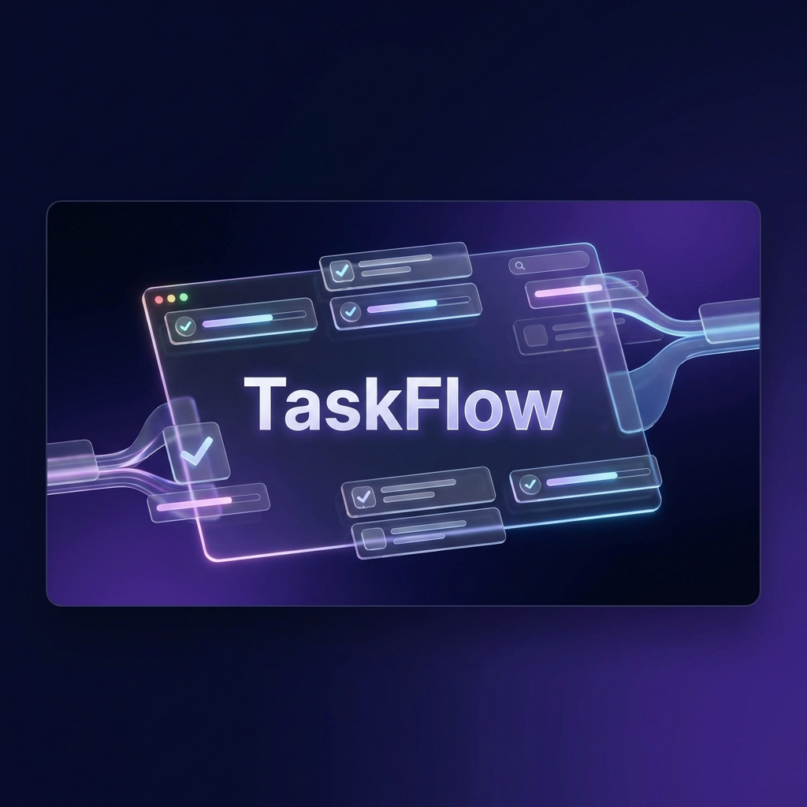
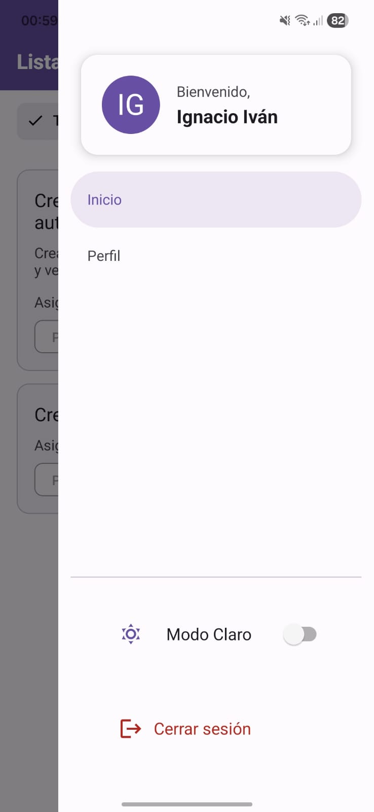

# TaskFlow - Gestión de Tareas Colaborativa



TaskFlow es una aplicación de gestión de tareas colaborativa full-stack construida con un backend en Go + Gin y una aplicación móvil en React Native + Expo.

## 🚀 Características

### Backend (Go + Gin)
- ✅ API RESTful con autenticación JWT
- ✅ Base de datos PostgreSQL con GORM
- ✅ WebSocket para notificaciones en tiempo real
- ✅ Documentación Swagger/OpenAPI
- ✅ Tests unitarios con >80% de cobertura
- ✅ Listo para Docker y docker-compose

### App Móvil (React Native + Expo)
- ✅ Arquitectura MVVM
- ✅ Soporte para modo oscuro
- ✅ Modo offline con sincronización automática
- ✅ Autenticación biométrica (Face ID / Touch ID / Huella)
- ✅ Actualizaciones en tiempo real vía WebSocket
- ✅ Material Design con React Native Paper
- ✅ Tests unitarios

## 📋 Requisitos

### Backend
- Go 1.21+
- PostgreSQL 15+
- Docker y Docker Compose (opcional)

### Móvil
- Node.js 18+
- npm o yarn
- Expo CLI
- Simulador iOS (macOS) o Emulador Android

## 🏗️ Arquitectura

```
┌─────────────────┐         ┌──────────────────┐
│     App Móvil   │◄───────►│   Backend API    │
│  (React Native) │  HTTP   │   (Go + Gin)     │
│                 │  + WS   │                  │
└─────────────────┘         └──────────────────┘
        │                            │
        │ AsyncStorage              │ GORM
        ▼                            ▼
┌─────────────────┐         ┌──────────────────┐
│   Caché Local   │         │   PostgreSQL     │
└─────────────────┘         └──────────────────┘
```

### Arquitectura Backend

```
backend/
├── cmd/server/          # Punto de entrada
├── internal/
│   ├── config/         # Configuración
│   ├── database/       # Conexión a BD y migraciones
│   ├── models/         # Modelos de datos
│   ├── handlers/       # Controladores HTTP
│   ├── services/       # Lógica de negocio
│   ├── repository/     # Capa de acceso a datos
│   ├── middleware/     # Auth, CORS, etc.
│   └── websocket/      # Hub de WebSocket
└── tests/              # Tests unitarios
```

### Arquitectura Móvil (MVVM)

```
mobile/src/
├── models/             # Modelos de datos (Interfaces TypeScript)
├── services/           # API, Almacenamiento, WebSocket (Capa de Datos)
├── contexts/           # Gestión de Estado (ViewModel)
├── screens/            # Componentes de UI (Vista)
├── navigation/         # Configuración de navegación
└── theme/              # Colores y estilos
```

## 🚀 Inicio Rápido

### Opción 1: Docker (Recomendado)

```bash
# Clonar repositorio
git clone <repository-url>
cd taskflow

# Iniciar backend con Docker
docker-compose up --build

# El backend estará disponible en:
# API: http://localhost:8080
# Swagger: http://localhost:8080/swagger/index.html
```

### Opción 2: Desarrollo Local

#### Backend

```bash
cd backend

# Instalar dependencias
go mod download

# Copiar archivo de entorno
cp .env.example .env

# Editar .env con tus credenciales de PostgreSQL

# Generar documentación Swagger
swag init -g cmd/server/main.go -o docs

# Ejecutar
go run cmd/server/main.go
```

#### App Móvil

**Opción 1: Android (Instalación Directa)**
- Descarga e instala el archivo `.apk` disponible en este repositorio.
- Asegúrate de que tu dispositivo esté en la misma red que el backend o que el backend sea accesible públicamente.

**Opción 2: iOS y Desarrollo (Expo Go)**
1. Descarga la app **Expo Go** (App Store / Play Store).
2. En la terminal:
   ```bash
   cd mobile
   npm install
   npm start
   ```
3. Escanea el código QR generado en la terminal:
   - **iOS**: Usa la aplicación de Cámara.
   - **Android**: Usa la app de Expo Go.

## 📱 Capturas de Pantalla

| Inicio de Sesión | Lista de Tareas |
|:---:|:---:|
|  |  |
| **Perfil de Usuario** | **Creación de Tarea** |
|  |  |
| **Menú Interactivo** | **Detalle de Tarea** |
|  |  |

## 📖 Documentación de la API

Una vez que el backend esté corriendo, accede a Swagger UI en:

```
http://localhost:8080/swagger/index.html
```

### Endpoints Principales

| Método | Endpoint | Descripción |
|--------|----------|-------------|
| POST | `/api/v1/auth/register` | Registrar nuevo usuario |
| POST | `/api/v1/auth/login` | Iniciar sesión |
| POST | `/api/v1/auth/refresh` | Refrescar token |
| GET | `/api/v1/tasks` | Listar tareas (paginado) |
| POST | `/api/v1/tasks` | Crear tarea |
| GET | `/api/v1/tasks/{id}` | Obtener tarea por ID |
| PUT | `/api/v1/tasks/{id}` | Actualizar tarea |
| DELETE | `/api/v1/tasks/{id}` | Eliminar tarea |
| PATCH | `/api/v1/tasks/{id}/status` | Actualizar estado de tarea |
| POST | `/api/v1/tasks/{id}/assign` | Asignar tarea a usuario |
| GET | `/api/v1/ws` | Conexión WebSocket |

## 🧪 Pruebas

### Tests de Backend

```bash
cd backend

# Ejecutar todos los tests
go test ./... -v

# Con cobertura
go test ./... -cover -coverprofile=coverage.out
go tool cover -html=coverage.out
```

### Tests de Móvil

```bash
cd mobile

# Ejecutar tests
npm test

# Con cobertura
npm run test:coverage
```

## 🐳 Despliegue con Docker

El proyecto incluye una configuración completa de Docker:

```bash
# Construir e iniciar todos los servicios
docker-compose up --build

# Detener servicios
docker-compose down

# Ver logs
docker-compose logs -f backend
docker-compose logs -f postgres
```

Servicios:
- **Backend**: http://localhost:8080
- **PostgreSQL**: localhost:5432
- **Swagger**: http://localhost:8080/swagger/index.html

## 🔑 Variables de Entorno

### Backend (.env)

```env
SERVER_PORT=8080
DB_HOST=localhost
DB_PORT=5432
DB_USER=taskflow
DB_PASSWORD=taskflow123
DB_NAME=taskflow_db
JWT_SECRET=tu-clave-secreta
JWT_EXPIRATION_HOURS=24
ALLOWED_ORIGINS=http://localhost:19006
```

### Móvil (app.json)

```json
{
  "expo": {
    "extra": {
      "apiUrl": "http://TU_IP:8080",
      "wsUrl": "ws://TU_IP:8080"
    }
  }
}
```

## 📊 Esquema de Base de Datos

```sql
Users
├── id (UUID, PK)
├── email (VARCHAR, UNIQUE)
├── password (VARCHAR, HASHED)
├── name (VARCHAR)
├── created_at (TIMESTAMP)
└── updated_at (TIMESTAMP)

Tasks
├── id (UUID, PK)
├── title (VARCHAR)
├── description (TEXT)
├── status (ENUM: pending, in_progress, completed, cancelled)
├── priority (ENUM: low, medium, high, urgent)
├── due_date (TIMESTAMP, NULLABLE)
├── created_by (UUID, FK -> Users)
├── assigned_to (UUID, FK -> Users, NULLABLE)
├── created_at (TIMESTAMP)
└── updated_at (TIMESTAMP)
```

## 🎯 Decisiones Técnicas

### ¿Por qué Go + Gin?
- **Rendimiento**: Gin es uno de los frameworks más rápidos de Go
- **Simplicidad**: Código limpio e idiomático
- **Concurrencia**: Goroutines integradas para WebSocket
- **Seguridad de Tipos**: El tipado estático previene errores en tiempo de ejecución

### ¿Por qué React Native + Expo?
- **Multiplataforma**: Un solo código base para iOS y Android
- **Desarrollo Rápido**: Hot reload, actualizaciones OTA
- **Características Nativas**: Fácil acceso a biometría, almacenamiento
- **Ecosistema Expo**: Rico conjunto de módulos preconstruidos

### ¿Por qué MVVM?
- **Testabilidad**: Lógica de negocio separada de la UI
- **Mantenibilidad**: Clara separación de responsabilidades
- **Escalabilidad**: Fácil de añadir nuevas funcionalidades
- **Colaboración**: Diferentes desarrolladores pueden trabajar en diferentes capas

### ¿Por qué PostgreSQL?
- **Fiabilidad**: Cumplimiento ACID
- **Características**: Soporte JSON, búsqueda de texto completo
- **Escalabilidad**: Mejor que SQLite para producción
- **Comunidad**: Excelente documentación y soporte

## 🚀 Mejoras Futuras

- [ ] Notificaciones Push (Firebase Cloud Messaging) cuando una tarea cambia de prioridad, estado o fecha de vencimiento
- [ ] Registro de modificaciones en tareas (quien hizo qué modificación sobre qué tarea)
- [ ] Abarcar > 80% de cobertura de tests
- [ ] Soporte para equipos/espacios de trabajo
- [ ] Categorías y etiquetas de tareas
- [ ] Panel de análisis (Analytics)
- [ ] Notificaciones por correo electrónico
- [ ] Integración con calendario
- [ ] Plantillas de tareas
- [ ] Pipeline CI/CD (GitHub Actions)
- [ ] Despliegue en Kubernetes

## ⚠️ Consideraciones de Despliegue y Conectividad

Esta aplicación está diseñada para funcionar en un entorno local (Docker).
*   **Idealmente (Producción):** El backend debería desplegarse en un servidor en la nube con un dominio público (ej. `api.taskflow.com`), lo que permitiría que la App Móvil se conecte automáticamente desde cualquier lugar.
*   **Entorno Actual (Prueba):** Como el backend corre en tu PC local, la App Móvil (APK) necesita saber la dirección IP de tu computadora para conectarse.
    *   **Solución:** Se incluyó un **Botón de Configuración** en la pantalla de Login que permite ingresar manualmente la IP del servidor (ej. `http://192.168.1.X:8080`) para facilitar las pruebas en diferentes redes WiFi sin recompilar.

## 📝 Licencia

Licencia MIT - ver archivo LICENSE para más detalles

## 👤 Autor

Desarrollado por Ignacio Ibaigorria como evaluación técnica para Teamcore.

---

**Construido con ❤️ usando Go, React Native, y mucho café ☕**
